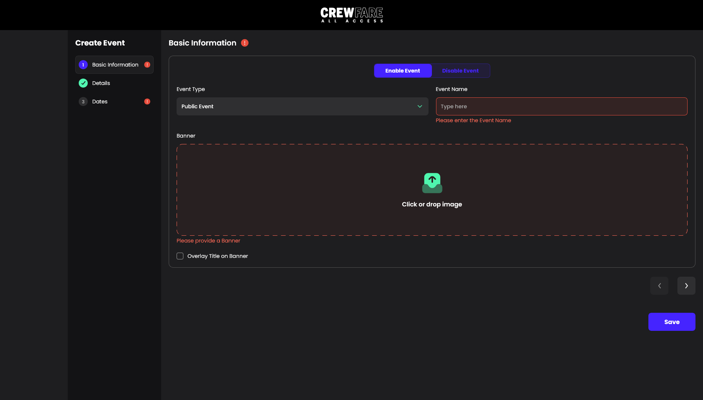
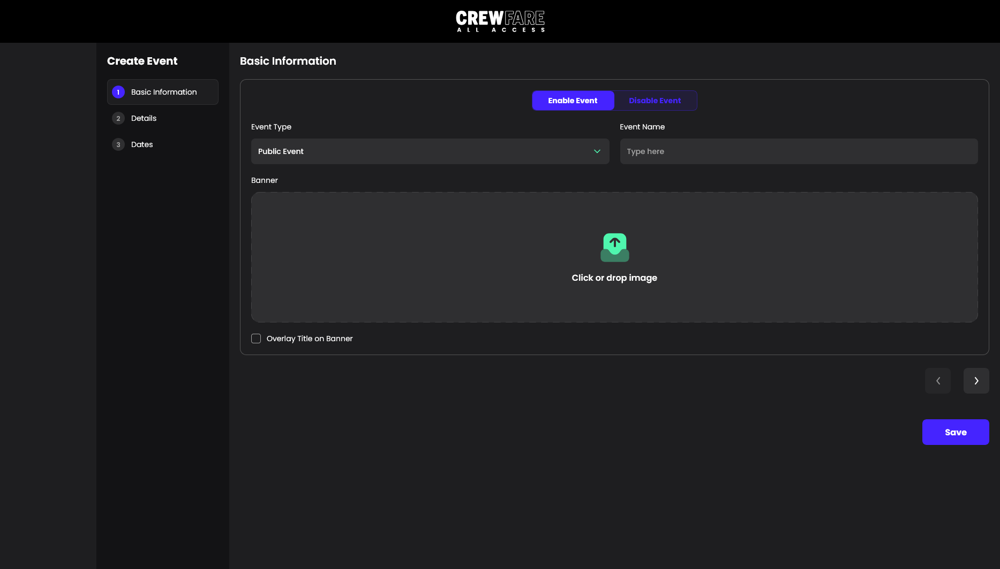
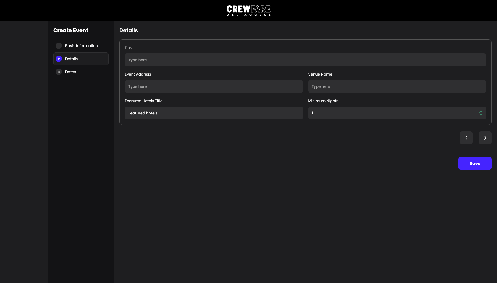
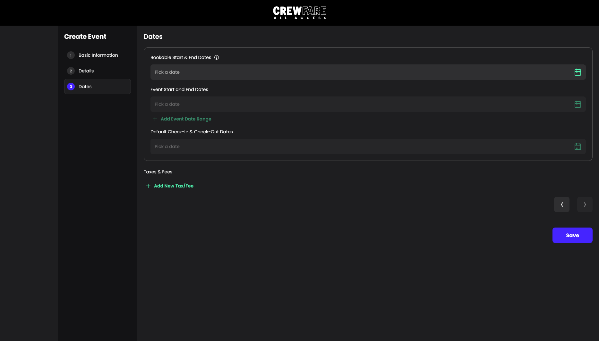

# Crewfare All Access - Book Event Form #

Next.js application designed to streamline event management. Built with server side rendering with NextJS, TypeScript, TailwindCSS and other modern tools. Provides a seamless experience for creating and managing events.
The application includes testing with Jest and a very detailed component documentation using Storybook.

## Live ##

Explore the deployed project and Storybook:

- **Live Demo** - [https://crewfare-all-access.vercel.app/](https://crewfare-all-access.vercel.app/)

- **Storybook** - [https://crewfare-all-access-storybook.vercel.app/](https://crewfare-all-access-storybook.vercel.app/)

## Installation Steps ##

To get the project up and running:

1. Clone the repo:

  ```shell
  git clone https://github.com/GilbertoFreitasJunior997/crewfare-all-access.git
  cd crewfare-all-access
  ```

2. Install dependencies using **[pnpm](https://pnpm.io/installation)**:

  ```shell
  pnpm install
  ```

3. Start the application:

  ```shell
  pnpm dev
  ```

## Design System and Documentation ##

**Storybook** is fully integrated, providing a very rich documentation and examples of all components.

You can run it with:

```shell
  pnpm storybook
```

## Testing ##

The project includes **Jest**. You can test it with:

```shell
  pnpm test
```

## Project Screenshots ##

### Validated Form ###



### Basic Information Step ###



### Details Step ###



### Dates Step ###



## Features ##

Here're some of the project's best features:

- Implements the **[Atomic Design](https://atomicdesign.bradfrost.com/chapter-2/)** Methodology
- Granular commits following the **[Conventional Commits Specs](https://www.conventionalcommits.org/en/v1.0.0/)**
- Multi-step form with validations for each section.
- A vertical stepper for easy navigation.
- Pixel Perfect implementation of base design.
- Scrollbars and user-friendly enhancements for handling extensive data
- Comprehensive Storybook integration with component stories

## Built with ##

Technologies used in the project:

- NextJs
- React
- TailwindCSS
- Typescript
- Storybook
- Jest
